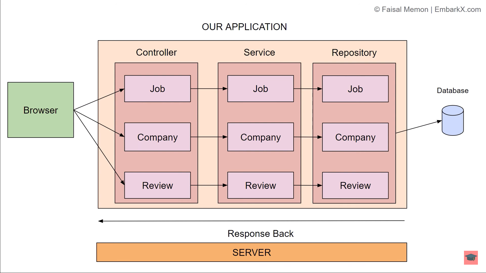

## Architecture

## Endpoints

### job

- GET  `/jobs`             : get all jobs.
- GET  `/jobs/{id}`        : get specific job by Id.
- POST `/jobs`             :create a new job (request body should contain the job details).
- DELETE `/jobs/{id}`      : Delete specific job by Id;
- PUT `/jobs/{id}`         : update specific job(request body should contain updated information ).
- GET `/jobs/{id}/company` : get the company associated to that job id .